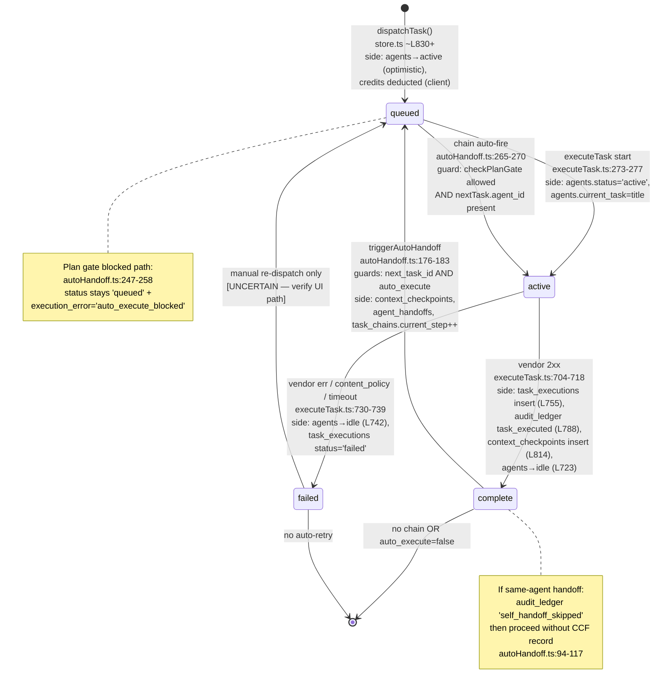

# COMMAND — Task Lifecycle Canonical Architecture
# GlobaLink LLC | Last updated: 260422
# Mode: [PERSISTENT] — ground truth for all future task/agent fixes

> **Purpose.** After 260422's 8-hour grinder — where each fix revealed two new bugs — this document is the single source of truth for every surface that reads or writes task and agent state. Future fixes must be planned against *this map*, not against symptoms. If a code change doesn't update this doc, it's incomplete.
>
> **Paths below are relative to** `command-app/command-app/` unless noted.

---

## 1. State Sources

Every piece of runtime state, where it lives, who writes, who reads, and what "stale" looks like.

### 1.1 `agents.status` (DB: `text`, default `'idle'`)

| Attribute | Value |
|---|---|
| Canonical location | `agents.status` on Supabase `public.agents` |
| Allowed values (observed) | `idle`, `active`, `error`, `rate_limited`, `stalled`, `offline`, `complete` (dashboard sort keys — `app/dashboard/page.tsx:36-44`) |
| **Writes (server)** | `lib/pipeline/executeTask.ts:273-277` → `'active'` at execution start; `executeTask.ts:723-727` → `'idle'` on success; `executeTask.ts:742-746` → `'idle'` on failure |
| **Writes (client)** | `components/tasks/TaskOutputPanel.tsx:497` → `updateAgent(agentId, { status:'idle', currentTask:'' })` on panel `complete`/`error`. Bypasses Realtime — writes through Zustand `updateAgent()` → `lib/store.ts:707-714` which also persists to Supabase |
| **Writes (Zustand)** | `lib/store.ts` `updateAgent()` around line 707; `dispatchTask()` marks agents `'active'` in local state around line 915–925 [UNCERTAIN — verify at source] |
| **Reads** | `components/AgentCard.tsx:268-281` (badge meta); `app/dashboard/page.tsx:36-44` (sort order); `lib/polling/scheduler.ts:24-30` (dynamic poll interval); `lib/pipeline/semanticMatcher.ts:120` (routable-agent filter — excludes `status='error'`) |
| Polling | `lib/polling/scheduler.ts` — 5s if `active`, 30s if `error`, 15s otherwise. Recursive `setTimeout` loop (line 75-87). Started from `app/dashboard/page.tsx:22`. |
| Realtime | **None** — agents.status is polled, not subscribed. `components/AgentCard.tsx:173-215` subscribes only to `audit_ledger` for activity feed, NOT to agents table. |
| Stale shape | Agent shows `'active'` after task succeeded because (a) server `idle` write failed silently and (b) polling interval hasn't fired, AND (c) TaskOutputPanel fallback `updateAgent` in `TaskOutputPanel.tsx:497` didn't fire because panel never reached `complete` (e.g., chain auto-dispatch runs server-side with no panel). |

### 1.2 `agents.current_task` (DB: `text`, nullable)

| Attribute | Value |
|---|---|
| Writes | `executeTask.ts:275` (set to `task.title`); `executeTask.ts:725, 744` (null on complete/fail) |
| Reads | Sidebar display (rendered inside AgentCard under the name); `buildContextBrief` roster display |

### 1.3 `tasks.status` (DB: `text`, default `'queued'`)

| Attribute | Value |
|---|---|
| Allowed values (observed) | `queued`, `active`, `complete`, `failed` — plus `canvas_steps.execution_status` (`skipped`, `running`, `complete`, `failed`) for canvas-orchestrated steps |
| **Writes** | `executeTask.ts:704-718` → `'complete'` on vendor success with result + vendor_response + execution_model + execution_tokens + execution_ms + executed_at; `executeTask.ts:730-739` → `'failed'` with execution_error; `autoHandoff.ts:176-183` → `'queued'` on chained next task; `autoHandoff.ts:248-257` → `'queued'` again + `execution_error='auto_execute_blocked'` when plan gate blocks; client-side `lib/store.ts:1607-1619` `updateTaskStatus()` (optimistic) |
| Reads | `autoHandoff.ts:53-60` (chain precondition); `routerExecution.ts:171` (agent assignment); router page + dashboard UI |
| Stale shape | Client store shows `complete`, DB still shows `active`, because optimistic store update preceded Supabase round-trip that failed. Dashboard polling overwrites with DB value on next tick, causing status flicker. |

### 1.4 `tasks.execution_mode` — **DOES NOT EXIST**

Critical: the schema has **no `execution_mode` column** (confirmed via `information_schema.columns` query, 260422). `execution_mode` exists only as:
- An optional parameter `executeTask({ execution_mode?: 'auto'|'manual' })` in `lib/pipeline/executeTask.ts:122` — never persisted.
- A derived field on the client-side `dispatchBrief` in `app/router/page.tsx` (~line 1441-1485).
- A field on the `TaskOutputPanel` prop bag (`brief.executionMode`).

Source of truth for "was this auto or manual": **audit_ledger event_type** (`router_auto_executed` vs `router_manual_executed` vs `router_override`) plus the audit event written by `autoHandoff.ts:230` (`auto_handoff_triggered`). This is inference, not state.

### 1.5 `tasks.next_task_id`, `tasks.auto_execute`, `tasks.chain_id`, `tasks.chain_order`, `tasks.handoff_to`

| Column | Purpose | Writer | Reader |
|---|---|---|---|
| `next_task_id` | Points to the chained successor task | `app/api/tasks/chain/route.ts:156` | `autoHandoff.ts:56, 68` |
| `auto_execute` | Permission to fire next_task_id server-side after completion | Same as above | `autoHandoff.ts:56, 72` |
| `chain_id` | Membership in a multi-step `task_chains` row | `tasks/chain/route.ts:156, 170` | `autoHandoff.ts:56, 190-208` |
| `chain_order` | Position within chain | `tasks/chain/route.ts:170` | `autoHandoff.ts:82` |
| `handoff_to` | Legacy/single-pass handoff target; superseded by chain linkage | [UNCERTAIN — verify] | [UNCERTAIN] |

### 1.6 Credits — `workspaces.starter_credits_used`, `workspaces.starter_credits_usd`

| Attribute | Value |
|---|---|
| Schema | `numeric`, default `0.00` (used), `10.00` (usd cap) |
| **Only writer** | `lib/credits.ts:54-59` — `deductCredits()` via RPC `increment_starter_credits_used`. |
| **Only caller of `deductCredits`** | `lib/store.ts:1114` inside `dispatchTask()`. Fired at **dispatch time** using `routing.estimatedCost` (not actual tokens). |
| NOT wired | `lib/credit-hooks.ts::beforeLLMCall / afterLLMCall` are **documented TODOs** in `app/api/pitch/route.ts:2` and `app/api/tasks/dispatch/route.ts:2` — never integrated. Server-side execution (`executeTask.ts`) performs **zero credit operations**. |
| Reads | `lib/credits.ts:31, 41` (getCreditsState); `lib/credit-hooks.ts:39-66` (beforeLLMCall); dashboard UsageMeter; `lib/billing/planGate.ts` (plan gate, called from `routerExecution.ts` and `autoHandoff.ts:246`). |

### 1.7 `audit_ledger`

| Attribute | Value |
|---|---|
| Identity | `(workspace_id, entry_seq)` logically unique; also `id` unique |
| Core writer | `lib/ledger.ts:102-116` — upsert with 3-retry on `23505` sequence collision |
| Direct inserts (not via ledger.ts) | `executeTask.ts:314, 788` (`.insert()` — no onConflict); `autoHandoff.ts:104, 226, 283, 310` (`.insert()`); `canvasExecution.ts` (upsert, `onConflict:'id'`); `routerExecution.ts` (upsert); `tasks/dispatch/route.ts:117` (upsert); `tasks/chain/route.ts:179` (upsert); `lib/canvas/audit.ts:92` (upsert) |
| Known mismatch | Several sites read `lastEntry.entry_seq` then `.insert()` (not upsert) — race possible, fix 19293c6 converted many to upsert-with-ignoreDuplicates, then **6845bf5 reverted 7 sites back to `.insert()`** because onConflict:'id' was generating 400s (per `state.md` 260422 entry). The audit_ledger layer is in mid-refactor. |
| Reads | Dashboard activity feed; `lib/canvas/audit.ts` queries; tests. |

### 1.8 `task_executions`

| Attribute | Value |
|---|---|
| Writer | `executeTask.ts:755-771` — one row per vendor call; system_prompt redacted to `'[redacted]'`, SHA-256 hash + length stored instead |
| Reads | Ops dashboards, debug tooling [UNCERTAIN — verify at source for any runtime control flow read] |

### 1.9 Client state — Zustand store (`lib/store.ts`)

- `agents[]` — parallel to DB, updated optimistically by `updateAgent()` (~line 707) and refreshed via polling scheduler callback.
- `tasks[]` — optimistic writes in `dispatchTask()` (~line 830+) and `updateTaskStatus()` (~line 1607).
- `workspace.starterCreditsUsed` — optimistically incremented at `store.ts:1119` after successful `deductCredits`.
- `log[]` — `addLogEntry()` around line 1477.
- First-win flags persisted to localStorage (~line 631).

### 1.10 URL params (router page)

`searchParams.get("agentId")` was an auto-populating source for the ASSIGN TO dropdown. Removed 260422 (state.md FIX 3) — default is now unconditional `"auto"`.

---

## 2. Task Lifecycle — Canonical State Machine



**Cancel branch.** No explicit `cancelled` status exists in the `tasks.status` enum observed. The 4-second override window in `routerExecution.ts` (`OVERRIDE_WINDOW_MS=4000`) writes an audit `router_override` event and returns without transitioning the task — the task is never created on an override, per the router flow.

**Failure side effects that DO NOT happen:**
- No credit refund on failed vendor call (credits deducted at dispatch, never reversed).
- No automatic retry.
- No alert/notification (ops-alert.ts usage [UNCERTAIN — not traced]).

---

## 3. Credit Accounting

### 3.1 Deduction timing

```
User clicks Send
   │
   ▼
app/router/page.tsx handleDispatch (~L1407)
   │
   ▼
lib/store.ts dispatchTask (~L830+)
   ├─ selectModel() → routing.estimatedCost  (based on token heuristic, NOT actual usage)
   ├─ deductCredits(workspaceId, routing.estimatedCost) [store.ts:1114]
   ├─ workspace.starterCreditsUsed += estimatedCost (optimistic, L1119)
   ├─ writeLedgerEntry api_call (L1124) — UI shows spend in /settings/usage
   └─ fire-and-forget POST /api/tasks/dispatch (outbound webhook) or /api/agents/proxy (vendor call)
```

### 3.2 Where credits are NOT adjusted

| Surface | Observed | Consequence |
|---|---|---|
| `lib/pipeline/executeTask.ts` | No credit read/write | Server-side executions (chain auto-fire, webhook-initiated) are **free**. |
| `app/api/tasks/execute/route.ts` | Delegates to executeTask | Same as above. |
| `app/api/tasks/dispatch/route.ts` | TODO comment L2-5, not wired | Outbound webhook dispatch doesn't deduct. |
| `app/api/pitch/route.ts` | TODO comment L2-5, not wired | PainToPitch stream is free. |
| Failure path | No refund anywhere | Client credits lost on failed dispatch. |
| Chain auto-dispatch | autoHandoff → executeTask, no hook | Every chain step after the first is free. |

### 3.3 Double-deduct risk surfaces

1. **Client re-dispatch.** `dispatchTask()` has no idempotency key; if user clicks Send twice, `deductCredits` fires twice. No guard observed.
2. **Network retry in `deductCredits`.** RPC `increment_starter_credits_used` is atomic server-side (per SQL name), but any client-side retry around `store.ts:1114` would double-charge. No retry logic observed — OK.
3. **Chain-refund hole.** If step 1 succeeds and deducts, step 2 (auto-fired by autoHandoff) consumes compute but doesn't deduct. This is a *silent under-deduction*, not a double-deduct.
4. **Optimistic store drift.** `store.ts:1119` increments `workspace.starterCreditsUsed` locally even if the RPC fails silently (`deducted = false` path leaves local state alone — verified at L1115).

### 3.4 Refund on failure

**MISSING.** No RPC `decrement_starter_credits_used` observed. `executeTask.ts` failure branch (L730-739) does not emit any credit event. This needs to be addressed before any paid plan.

---

## 4. Chain Execution — End to End

User flow: set `THEN SEND TO = Claude-1`, click Send while Perplexity is the primary agent.

```
T+0  Router page handleDispatch
     ├─ routeAndExecute() decides Perplexity (auto)
     ├─ dispatchBrief.handoffAtSendTime = 'Claude-1' (router/page.tsx ~L1484)
     ├─ dispatchTask(…) creates task_A
     └─ POST /api/tasks/chain:
          - INSERT task_chains total_steps=2      (tasks/chain/route.ts:134)
          - UPDATE task_A next_task_id=task_B,
                         auto_execute=true,
                         chain_id=…              (L156)
          - INSERT task_B chain_id, chain_order   (L170)
          - audit_ledger 'task_chained'           (L179)

T+1  4-second override window (OVERRIDE_WINDOW_MS)
     router page polls overrideSignal.cancelled
     no override → executeAndReturn()

T+2  app/api/tasks/execute POST
     ├─ executeTask.ts:273-277 agents.status='active'
     ├─ vendor call (Perplexity)
     ├─ executeTask.ts:704-718 tasks.status='complete'
     ├─ executeTask.ts:723-727 agents.status='idle'
     └─ app/api/tasks/execute/route.ts:177 calls triggerAutoHandoff()

T+3  autoHandoff.ts
     ├─ L53-60 fetch task_A (next_task_id, auto_execute, chain_id, result)
     ├─ L67-75 guards pass (both truthy)
     ├─ L80-85 fetch task_B (agent_id=Claude-1)
     ├─ L94 self-handoff? (no — different agents)
     ├─ L120-131 build CCF (decisions, open_questions, artifacts, constraints, checksum)
     ├─ L137-149 INSERT context_checkpoints
     ├─ L156-170 INSERT agent_handoffs from_agent=Perplexity, to_agent=Claude-1
     ├─ L176-183 UPDATE task_B.status='queued'
     ├─ L190-208 task_chains.current_step += 1
     ├─ L226-238 audit_ledger 'auto_handoff_triggered'
     ├─ L246 checkPlanGate → allowed
     └─ L265-270 await executeTask(task_B, Claude-1)  ← recursive pipeline entry

T+4  executeTask for task_B runs full lifecycle again
     (no credit deduction at this step — see §3.2)

T+5  (only if task_B was itself chained to a task_C — would recurse again)
```

### 4.1 Three separate auto-handoff entrypoints — **CHAIN FRATRICIDE RISK**

Grep for `triggerAutoHandoff`:

| Entrypoint | Calls | Implementation |
|---|---|---|
| `app/api/tasks/execute/route.ts:177` | `lib/pipeline/autoHandoff.ts::triggerAutoHandoff` | Canonical |
| `app/api/agent-events/route.ts:295` | Same canonical function (via wrapper `runAutoHandoff`) | Canonical |
| `app/api/agents/proxy/route.ts:131,467` | **Local private function also named `triggerAutoHandoff`** | Different CCF construction, different truncation, adds outbound dispatch step |

Per `docs/audit/R1_connections_execution_billing_mcp.md:243`: *"Two separate auto-handoff implementations… different CCF field construction logic, different truncation methods."*

**Consequence.** Whether a chain fires, and what CCF payload looks like, depends on *which HTTP route reported the task complete*. Webhook-based agents (agent-events) and vendor-pipeline agents (tasks/execute) share the canonical autoHandoff. Proxy-invoked agents take a different path. This is the single most likely root cause of "chain fires sometimes, not others."

---

## 5. Router Decision Tree

Entry: `lib/pipeline/routerExecution.ts::routeAndExecute()`.

### 5.1 Agent scoring (`semanticMatcher.ts:120-158`)

```
combinedScore = keywordScore * 0.5 + historyScore * 0.3 + semanticScore * 0.2

keywordScore:
  60 if agent.agent_type matches inferTaskTypeFromDescription(task)
  30 otherwise
  +5 per matching entry in agent.skills (cap +20)
  +5 per matching entry in agent.domain_tags (cap +20)

historyScore:
  50 if no routing_decisions in last 30 days for this agent
  else (successes / total_outcomes) * 100

semanticScore:
  Currently hardcoded 0 (Phase 3 — embedding similarity stub)
```

Source: `lib/pipeline/semanticMatcher.ts` around L120-158.

### 5.2 `inferTaskTypeFromDescription` signals — `lib/task-router-engine.ts:126-139`

```
build    /\b(build|code|fix|deploy|implement|create component|scaffold|repo)\b/
content  /\b(write|draft|compose|article|blog|email|outreach|copy|social)\b/
research /\b(research|find|look up|analyze data|compare|investigate|evaluate|assess|explore|examine|benchmark|survey|discover|review|study)\b/
ops      /\b(schedule|organize|manage|process|workflow|plan|strategy|decide|evaluate|roadmap|pricing|audit|digest)\b/
```

Tiebreaker ranking is by `combinedScore` DESC. No explicit tiebreaker logic below that — first agent in array wins on equal score.

### 5.3 ASSIGN TO = manual vs Auto

- Dropdown default is `"auto"` (unconditional — `app/router/page.tsx` `routeTo` init, fix 260422/FIX 3).
- If operator picks a specific agent → `routerExecution.ts` takes the manual branch, writes audit `router_manual_executed` (L246) and skips scoring.
- If `"auto"` + `combinedScore < AUTO_EXECUTE_THRESHOLD (75)` → low-confidence path: assigns agent, writes audit `router_low_confidence`, **does NOT execute**. Task sits as `queued`.
- If `"auto"` + score ≥ 75 → auto path: 4-second override window then `executeAndReturn()`.

### 5.4 Known edge cases

- **Score 75 tied to non-existent agent (seed gap).** If a workspace has only one agent and that agent is `status='error'`, `semanticMatcher.ts:120` filters it out → no candidates → fallback in `task-router-engine.ts:225-234` returns `all_agents_unavailable=true`.
- **"Ops" and "Research" keyword overlap** (`evaluate`, `review`). Task "review pricing" matches both ops and research signals; whichever runs second in the if-chain wins [UNCERTAIN — verify at `task-router-engine.ts:126-139`].

---

## 6. Sidebar / Agent Status Polling

Two cooperating loops + one no-op:

| Loop | File:line | Interval | What it does |
|---|---|---|---|
| Heartbeat polling (adaptive) | `lib/polling/scheduler.ts:39-87` | 5s active / 30s error / 15s default | POST `/api/agent-poll` → reads `agents.status, last_seen_at` → updates `agentStatusMap` → calls `onResult` callback |
| Card relative-time refresh | `components/AgentCard.tsx:141-144` | 10s | Re-renders "last seen" label only; does NOT re-query |
| Supabase Realtime (agents table) | — | — | **Not subscribed.** Only `audit_ledger` is subscribed (`AgentCard.tsx:173-215`) for the activity feed. |

### 6.1 Status → display mapping

`lib/agent-status-colors.ts` and `AGENT_STATUS_META` (referenced at `AgentCard.tsx:268-281`) map:

- `active` → "Working..." + TypingDots + amber pulse
- `idle` → "Idle"
- `error` → red
- `stalled` → yellow (derived from `last_seen_at > 5min`)
- `offline` → grey

### 6.2 Race-condition surfaces

1. **Server idle-write lands after polling starts next cycle.** ExecuteTask writes `status='idle'` (L723), but TaskOutputPanel has already called `updateAgent()` optimistically (TaskOutputPanel.tsx:497). If polling round-trip returns the *pre-idle* snapshot, it overwrites the optimistic `idle` with stale `active`.
2. **`updateAgent` client-side write racing server write.** Store's `updateAgent` around L707 writes to Supabase (L778). Two near-simultaneous writes (client + server executeTask) can interleave.
3. **Sidebar never subscribes to `agents` Realtime.** Any agent state change must propagate through polling — worst-case latency = 15s.

---

## 7. Execution Mode Enforcement

Because `tasks.execution_mode` doesn't exist in the schema (§1.4), enforcement is entirely UI-derived.

### 7.1 UI gates that hide manual flow

- `app/router/page.tsx` TaskBriefCard — `{!autoExecActive && brief.executionMode !== 'auto' && (...)}` gates Copy Brief button, "Open [Agent] and paste" text, Mark In Progress, Mark Complete, and the manual completion panel.
- `autoExecActive` is set TRUE by `onPanelStateChange` callback from `TaskOutputPanel` on panel `running` / `complete` transitions.

### 7.2 Where execution mode is set

- `routeAndExecute()` derives it from score: `confidence_score >= 75 → 'auto'`, else `'manual'`.
- `TaskBriefCard.dispatchBrief.executionMode` is set from that value (~`app/router/page.tsx:1441-1485`).

### 7.3 Known gaps

- **Nothing in the DB.** A page refresh after dispatch loses `executionMode`. The panel reloads in manual mode by default because there's no column to read from.
- **Auto-dispatched chain tasks** (fired from autoHandoff server-side) have no TaskOutputPanel at all — they execute headless. The sidebar is the only surface that can show state, and it can only show it by polling.
- **Webhook-origin tasks** (agent-events) never flow through TaskBriefCard → no UI gate → manual buttons would appear if the operator navigates to the task after execution [UNCERTAIN — verify at source in agent-events/route.ts].

---

## 8. Known Inconsistencies — Ranked by User Impact

| # | Inconsistency | How it manifests | Likely correct surface | Root cause |
|---|---|---|---|---|
| **I-1** | Three autoHandoff entrypoints with two implementations | Chain fires from tasks/execute but not from agents/proxy (or vice versa) | `lib/pipeline/autoHandoff.ts` canonical | Local function in `agents/proxy/route.ts:131` was forked before pipeline version existed and never deleted |
| **I-2** | `execution_mode` not persisted | Manual flow buttons appear on completed auto-tasks after refresh; chain form appears when THEN SEND TO was preset | `audit_ledger` event_type | Schema never added the column (`information_schema` confirms) |
| **I-3** | Sidebar "Working…" stuck after success | Agent shows active indefinitely on chain auto-fired tasks because no TaskOutputPanel exists to fire the client-side `updateAgent` fallback | `executeTask.ts:723-727` DB write | Sidebar relies on polling (15s worst case) + optimistic client write; chain tasks have no client panel |
| **I-4** | Credits deducted on dispatch, never refunded on failure | Bill shows spend for tasks that returned content_policy/500/timeout | `lib/store.ts:1114` | No refund RPC; no post-execution reconciliation |
| **I-5** | Chain-fired tasks don't deduct credits | Under-billing; first task on a chain is the only one that ever charges | Server-side hooks in `executeTask.ts` | `beforeLLMCall/afterLLMCall` are wired in `credit-hooks.ts` but never called from pipeline |
| **I-6** | audit_ledger `.insert()` vs `.upsert()` mid-refactor | 400s on entry_seq conflict; occasional 409s | ledger.ts pattern | Two back-to-back fixes (19293c6, 6845bf5) moved sites in opposite directions |
| **I-7** | Router picks "obvious wrong" agent | Operator picks a writing task → research agent fires | `semanticMatcher.combinedScore` | `semanticScore=0` (Phase 3 stub) — scoring collapses to 50% keyword + 30% history; tiny history swings score |
| **I-8** | Chain UI gate (`preConfiguredHandoffAgentId`) inconsistent | Chain creation form appears even when THEN SEND TO was set | `dispatchBrief.handoffAtSendTime` (router/page.tsx ~L1484) | Fixed 260422 but depends on `handoffAtSendTime` being captured BEFORE state reset — any new auto-exec path that resets state early will regress |
| **I-9** | Two CC sessions overwrite each other's commits | "Session eating" — last push wins | Not a runtime bug — ops | Git discipline + brain routing; orthogonal to this doc |

---

## 9. Recommended Fix Batch (grouped by state surface, not bug)

Fix batches below are ordered by inconsistency-eliminated per unit of work. Each batch is a coordinated change — do not split.

### Batch A — **Collapse the three autoHandoff paths** (addresses I-1, partially I-3, I-5)

1. Delete `triggerAutoHandoff` local function in `app/api/agents/proxy/route.ts:131-*`.
2. Import canonical `lib/pipeline/autoHandoff::triggerAutoHandoff` at `agents/proxy/route.ts:467`.
3. Move any outbound-dispatch side-effects from the deleted local function into the canonical path, gated on a new optional `dispatchOutbound?: boolean` parameter.
4. Verify: three grep hits for `triggerAutoHandoff` import resolve to one source file.

### Batch B — **Server-side agent status ownership** (addresses I-3)

1. Remove client-side `updateAgent(agentId, { status:'idle' })` in `TaskOutputPanel.tsx:497`.
2. Subscribe the dashboard / sidebar to Supabase Realtime on the `agents` table filtered by workspace_id.
3. Collapse polling interval to a 60s safety-net (not the primary truth source).
4. Verify: kill the server executeTask idle-write; sidebar still flips to idle within 1–2s via Realtime.

### Batch C — **Persist execution_mode + lifecycle state in DB** (addresses I-2, I-8)

1. Apply migration adding `tasks.execution_mode TEXT CHECK (execution_mode IN ('auto','manual')) DEFAULT 'manual'`.
2. Write it from `executeTask.ts` entry (L273-277 block) based on caller-provided param.
3. Read it in TaskBriefCard instead of deriving from `confidence_score`.
4. Same migration: `tasks.preconfigured_handoff_agent_id TEXT` to replace the ephemeral `handoffAtSendTime` capture.

### Batch D — **Credit lifecycle rewrite** (addresses I-4, I-5)

1. Move `deductCredits` call out of `store.ts:1114` (dispatch time) and into `executeTask.ts` post-vendor-call success branch, using actual token usage.
2. Wire `beforeLLMCall` in `executeTask.ts` before vendor call to gate budget.
3. Add `refundCredits` RPC; call it in the failure branch (L730-739).
4. Add idempotency key to `deductCredits` = `task_executions.id`; RPC takes `(workspace_id, amount, execution_id)`; server-side unique constraint on `(workspace_id, execution_id)` prevents double-charge.

### Batch E — **Audit ledger: one writer, one retry policy** (addresses I-6)

1. Replace every direct `supabase.from('audit_ledger').insert/upsert(…)` call with `writeLedgerEntry(…)` from `lib/ledger.ts`.
2. `ledger.ts` is already retry-safe on `entry_seq` conflicts.
3. Delete the redundant `SELECT entry_seq → insert()` pattern in executeTask.ts, autoHandoff.ts, and 3 other files.

### Batch F — **Router semantics** (addresses I-7)

1. Non-blocking; do last. Build the embedding stub in `semanticMatcher.ts:120-158` so `semanticScore > 0`. Alternatively: drop semantic weighting from 20% → 0% and re-distribute to keyword 60% / history 40% until embeddings ship.

---

## Source-of-truth answers for joining engineers

**Q: Where does agent status live?**
A: Canonically on `agents.status` in Supabase. Written only by `executeTask.ts:273-277` (active), `:723-727` (idle-success), `:742-746` (idle-fail). Mirrored in Zustand store (`lib/store.ts` `updateAgent`). Read by sidebar via polling (`lib/polling/scheduler.ts` — 5–30s). No Realtime subscription on the agents table.

**Q: When does a credit deduct?**
A: Once, at dispatch, on the client, in `lib/store.ts:1114` via `deductCredits()` → RPC `increment_starter_credits_used`. Amount = `routing.estimatedCost`, not actual tokens. Never deducted by the server. Never refunded. Chain-fired subsequent tasks never deduct.

**Q: Why did chain X not fire?**
A: Check, in order: (1) which HTTP route reported task completion — if it was `/api/agents/proxy`, the local autoHandoff ran, not the canonical one (I-1); (2) `tasks.next_task_id` and `tasks.auto_execute` both truthy (`autoHandoff.ts:67-75`); (3) `checkPlanGate` returned allowed (`autoHandoff.ts:246`); (4) `nextTask.agent_id` present (`autoHandoff.ts:262`). Vercel runtime logs filtered to `chain` will show which gate tripped (logging added in commits 6845bf5 and 19293c6 per state.md 260422).

**Q: What's the difference between `task.status` and `agent.status`?**
A: `task.status` describes the work (queued → active → complete/failed). `agent.status` describes the worker (idle → active → idle). They transition together in `executeTask.ts` but are separate writes — either can succeed while the other fails silently, which is I-3's root cause. A task can be `complete` while its agent is still `active` for up to 15 seconds (polling interval) if the idle write failed.

---

*End of document. Update this file before the next batch of task/agent fixes. If you change a write site, update §1. If you change a transition, update §2. Doc out of date ⇒ revert the PR.*
